# PatchFusionBERT: Post-Encoder Fusion for Patch-Based Long-Horizon Time Series Forecasting

> **Hussein Ahmad · Seyyed Kasra Mortazavi · Taha Benarbia · Fadi Al Machot · Kyandoghere Kyamakya**  
> Institute for Smart Systems Technologies, Universität Klagenfurt  
> *IEEE Access, 2026*

[](https://www.python.org/)
[](LICENSE)
[](https://github.com/thuml/Time-Series-Library)

---

## Table of Contents

1. [Overview](#overview)
2. [Architecture](#architecture)
3. [Main Results](#main-results)
4. [Statistical Validation](#statistical-validation)
5. [Repository Structure](#repository-structure)
6. [Installation](#installation)
7. [Reproduction Pipeline](#reproduction-pipeline)
   - [Step 1 — Data Preparation](#step-1--data-preparation)
   - [Step 2 — Main Benchmark (Table 2)](#step-2--main-benchmark-table-2)
   - [Step 3 — Multi-Seed Experiments (Tables 3 / 14)](#step-3--multi-seed-experiments-tables-3--14)
   - [Step 4 — Ablation Study (Table 8)](#step-4--ablation-study-table-8)
   - [Step 5 — Capacity-Matched Controls (Table 6)](#step-5--capacity-matched-controls-table-6)
   - [Step 6 — Statistical Tests](#step-6--statistical-tests)
   - [Step 7 — Efficiency Profiling (Table 13)](#step-7--efficiency-profiling-table-13)
   - [Step 8 — Robustness Experiments (Tables 15–16)](#step-8--robustness-experiments-tables-1516)
8. [Figures](#figures)
9. [Citation](#citation)
10. [Acknowledgements](#acknowledgements)

---

## Overview

**PatchFusionBERT (PFB)** is a lightweight augmentation of the PatchTST backbone for long-horizon time series forecasting.  
Rather than redesigning the encoder, PFB adds a **post-encoder BERT-style refinement stage** and an **adaptive fusion gate** that blends the refined patch representations with a direct linear shortcut — achieving consistent gains with minimal parameter overhead.

Two fusion variants are evaluated:

| Variant | Fusion mechanism | Extra params |
|---------|-----------------|--------------|
| **PFBv0** | Additive gated fusion | ≈ 0.4 M |
| **PFBv2** | Attention-weighted projection | ≈ 1.2 M |

All experiments follow the **BridgeLR unified protocol**: single seed 2021, DLinear LR = 1e-2, all patch models LR = 1e-4, `seq_len = 336`.

---

## Architecture

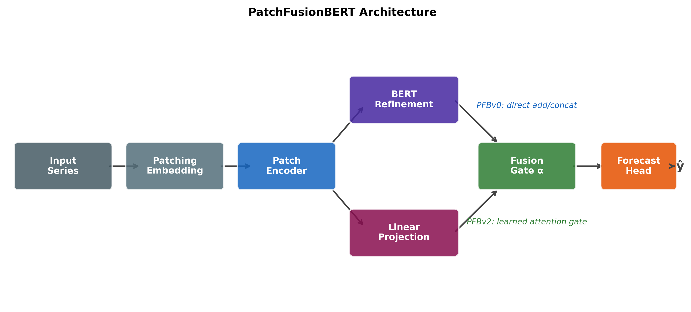

*Fig. 1 — PatchFusionBERT architecture. A PatchTST-style encoder feeds both a BERT refinement stage and a direct linear path. An adaptive gate fuses the two streams before the projection head.*

---

## Main Results (MSE / MAE — single seed, `seq_len = 336`)

**Bold** = best; second-best is underlined in the paper. Results cover the three primary horizons across seven public benchmarks under the unified BridgeLR protocol. Full results (ETTm1, Exchange, Illness) are in `paper/txt.tex`.

| Dataset | H | PFBv0 | PFBv2 | PatchTST | iTransformer | TiDE | TimeXer | DLinear |
|:--------|:-:|:-----:|:-----:|:--------:|:------------:|:----:|:-------:|:-------:|
| ETTh1 | 96 | **0.3675**/0.3952 | 0.3863/0.4053 | 0.3814/0.4063 | 0.3997/0.4174 | 0.3958/0.4141 | 0.3909/0.4076 | 0.3711/**0.3927** |
| ETTh1 | 192 | **0.4043**/0.4242 | 0.4198/0.4266 | 0.4312/0.4325 | 0.4495/0.4506 | 0.4283/0.4327 | 0.4239/0.4269 | **0.4043**/**0.4128** |
| ETTh1 | 336 | 0.4378/0.4476 | 0.4411/0.4404 | 0.4934/0.4901 | 0.4636/0.4645 | 0.4502/0.4466 | 0.4575/0.4532 | **0.4345**/**0.4352** |
| ETTh2 | 96 | 0.3054/0.3524 | 0.2893/0.3474 | 0.3145/0.3647 | 0.3062/0.3606 | 0.2914/0.3515 | 0.2969/0.3604 | **0.2836**/**0.3473** |
| ETTh2 | 192 | 0.3720/0.4004 | **0.3673**/**0.3952** | 0.3887/0.4118 | 0.3667/0.4009 | **0.3517**/**0.3903** | 0.3614/0.3972 | 0.3797/0.4151 |
| ETTh2 | 336 | **0.3814**/**0.4139** | 0.3955/0.4225 | 0.4059/0.4293 | 0.3988/0.4229 | **0.3736**/**0.4109** | 0.3945/0.4265 | 0.4257/0.4555 |
| ETTm2 | 96 | **0.1679**/0.2571 | 0.1695/0.2567 | 0.1728/0.2640 | 0.1749/0.2660 | 0.1690/0.2595 | 0.1716/**0.2562** | **0.1653**/0.2574 |
| ETTm2 | 192 | 0.2347/**0.2997** | 0.2347/0.3001 | 0.2282/0.3018 | 0.2475/0.3139 | **0.2241**/**0.2965** | 0.2311/0.2986 | **0.2273**/0.3077 |
| ETTm2 | 336 | **0.2739**/**0.3291** | 0.3014/0.3496 | 0.2935/0.3457 | 0.3020/0.3484 | 0.2780/0.3314 | 0.2870/0.3351 | 0.2930/0.3524 |
| Weather | 96 | **0.1496**/0.2007 | 0.1522/**0.2000** | 0.1526/0.2019 | 0.1603/0.2096 | 0.1764/0.2267 | 0.1508/0.2024 | 0.1782/0.2432 |
| Weather | 192 | **0.1936**/**0.2387** | 0.1938/0.2394 | 0.1962/0.2429 | 0.2031/0.2487 | 0.2185/0.2612 | **0.1942**/**0.2409** | 0.2179/0.2775 |
| Weather | 336 | 0.2517/0.2839 | **0.2446**/**0.2802** | 0.2479/0.2814 | 0.2527/0.2867 | 0.2659/0.2957 | **0.2453**/0.2811 | 0.2612/0.3116 |

---

## Statistical Validation

Five-seed validation (seeds 2019–2023) across six datasets, tested with Wilcoxon signed-rank and Holm-corrected p-values.

| Horizon pool | Comparison | MSE p (Holm) | MAE p (Holm) | Significant? |
|:------------|:-----------|:------------:|:------------:|:------------:|
| H=192 (9 configs) | PFBv0 vs DLinear | 0.027 | 0.00039 | ✅ Both |
| H=96 (6 datasets) | PFBv0 vs PatchTST | 0.056 | 0.00028 | ✅ MAE |
| H=336 (6 datasets) | PFBv0 vs PatchTST | 0.015 | 0.0044 | ✅ Both |
| H=336 (6 datasets) | PFBv0 vs DLinear | 0.070 | 0.028 | ✅ MAE |

---

## Repository Structure

```
.
├── models/                              # Model definitions
│   ├── PatchFusionBERT.py               #   Shared base class
│   ├── PatchFusionBERT_v0.py            #   PFBv0 — additive gate fusion (main)
│   ├── PatchFusionBERT_v2.py            #   PFBv2 — attention-weighted projection
│   ├── PatchFusionBERT_BERTOnly.py      #   Ablation: refinement only
│   ├── PatchFusionBERT_PatchOnly.py     #   Ablation: backbone only
│   ├── PatchFusionBERT_RefineOnly.py    #   Ablation: backbone + BERT, no gate
│   ├── PatchTST_LargeHead.py            #   Capacity control (3.45 M params)
│   ├── PatchTST.py                      #   Baseline
│   ├── DLinear.py                       #   Baseline
│   ├── iTransformer.py                  #   Baseline
│   ├── TiDE.py                          #   Baseline
│   └── TimeXer.py                       #   Baseline
│
├── exp/ layers/ data_provider/ utils/   # TSLib framework (unchanged)
│
├── scripts/                             # Experiment runner scripts
│   ├── bridging_lr_unified.ps1          #   Table 2 — 108 single-seed runs
│   ├── multiseed_h96_h336_5seed.ps1     #   Tables 3/14 — H=96,336 × 5 seeds
│   ├── run_multiseed_5seed_campaign.ps1 #   Table 3 — H=192 × 5 seeds
│   ├── b1_component_ablation_chain.ps1  #   Table 8 — ablation chain
│   ├── capmatch_controls.ps1            #   Table 6 — capacity-matched controls
│   └── capmatch_controls_ett_weather_96_336.ps1
│
├── analysis/                            # Result parsing and statistical tests
│   ├── analyze_bridging_lr.py           #   Parse Table 2 results
│   ├── analyze_h96_h336_multiseed.py    #   Parse H=96/336 multi-seed results
│   ├── analyze_capmatch_controls.py     #   Parse capacity control results
│   ├── analyze_b1_component_ablation.py #   Parse ablation results
│   ├── statistical_significance_multiseed_5seed.py  # Wilcoxon tests (H=192)
│   ├── add_fdr_correction.py            #   Holm + BH-FDR correction
│   └── results_analysis/wilcoxon_h96_h336.py        # Wilcoxon tests (H=96/336)
│
├── profiling/                           # Efficiency and parameter analysis
│   ├── count_params.py                  #   Parameter count (Table 13)
│   ├── measure_flops_macs.py            #   FLOPs / MACs (Table 13)
│   ├── benchmark_training_weather192.py #   Training throughput
│   └── benchmark_inference_weather192.py#   Inference throughput
│
├── robustness/                          # Robustness experiments
│   ├── robustness_missing_data.py       #   Tables 15–16 (random/block missingness)
│   ├── c2_gaussian_channel_robustness.py#   Gaussian noise + channel dropout
│   └── c4_cka_representation_similarity.py  # CKA analysis (Table 11)
│
├── results_analysis/                    # Parsed CSVs and LaTeX tables for paper
├── paper/
│   ├── txt.tex                          # Full manuscript (all corrections applied)
│   └── figures/                         # All 15 paper figures (Fig 1–7, A1–A8)
│
└── data/                                # Benchmark datasets (not tracked in git)
    ├── ETTh1.csv  ETTh2.csv
    ├── ETTm1.csv  ETTm2.csv
    ├── weather.csv  exchange_rate.csv
    └── national_illness.csv
```

---

## Installation

```bash
# Clone the repository
git clone https://github.com/Hussein-Ahmad-Ahmad/patchfusionbert-forecasting.git
cd patchfusionbert-forecasting

# Install dependencies
pip install -r requirements.txt
```

> **Python version:** 3.10+  
> **Dependencies:** PyTorch ≥ 2.0, einops, reformer-pytorch, and standard scientific stack.  
> See [`requirements.txt`](requirements.txt) for the full pinned list.

---

## Reproduction Pipeline

The diagram below shows the full experiment pipeline from data to paper tables:

```
Data Prep          Training (Step 2–5)            Analysis (Step 6–8)
──────────   ──────────────────────────────   ──────────────────────────────
data/*.csv → Main benchmark (Table 2)      → analyze_bridging_lr.py
             ├─ bridging_lr_unified.ps1        → LaTeX Table 2
             │
             ├─ Multi-seed H=192 (Table 3)  → analyze_h96_h336_multiseed.py
             │   run_multiseed_5seed_campaign.ps1
             │
             ├─ Multi-seed H=96/336 (T.14)  → statistical tests (Step 6)
             │   multiseed_h96_h336_5seed.ps1   → Wilcoxon + Holm FDR
             │
             ├─ Ablation (Table 8)          → analyze_b1_component_ablation.py
             │   b1_component_ablation_chain.ps1
             │
             ├─ Capacity control (Table 6)  → analyze_capmatch_controls.py
             │   capmatch_controls.ps1
             │
             └─ Robustness / Efficiency     → Tables 11, 13, 15–16
                (Steps 7–8)
```

### Step 1 — Data Preparation

Download the seven benchmark datasets from the [TSLib data guide](https://github.com/thuml/Time-Series-Library#data-preparation) and place the CSV files under `data/`:

```
data/ETTh1.csv   data/ETTh2.csv   data/ETTm1.csv   data/ETTm2.csv
data/weather.csv data/exchange_rate.csv data/national_illness.csv
```

---

### Step 2 — Main Benchmark (Table 2)

Runs all 108 single-seed experiments under the BridgeLR protocol.

```powershell
# Train all models (PFBv0, PFBv2, PatchTST, iTransformer, TiDE, TimeXer, DLinear)
.\bridging_lr_unified.ps1

# Parse results → Table 2 LaTeX
python analyze_bridging_lr.py
```

---

### Step 3 — Multi-Seed Experiments (Tables 3 / 14)

```powershell
# H=192, 5 seeds (seeds 2019–2023)
.\run_multiseed_5seed_campaign.ps1

# H=96 and H=336, 5 seeds
.\multiseed_h96_h336_5seed.ps1

# Parse results
python analyze_h96_h336_multiseed.py
```

---

### Step 4 — Ablation Study (Table 8)

Component ablation chain: Backbone → +BERT → +Gate (PFBv0) → +Projection (PFBv2).

```powershell
.\b1_component_ablation_chain.ps1
python analyze_b1_component_ablation.py
```

---

### Step 5 — Capacity-Matched Controls (Table 6)

Ensures PFBv0 gains are not simply due to having more parameters than PatchTST.

```powershell
.\capmatch_controls.ps1
.\capmatch_controls_ett_weather_96_336.ps1
python analyze_capmatch_controls.py
```

---

### Step 6 — Statistical Tests

Wilcoxon signed-rank tests with Holm and BH-FDR corrections over the multi-seed results.

```powershell
# Pooled H=192 tests
python statistical_significance_multiseed_5seed.py
python add_fdr_correction.py

# H=96 / H=336 tests
python results_analysis/wilcoxon_h96_h336.py
```

---

### Step 7 — Efficiency Profiling (Table 13)

```powershell
python count_params.py
python measure_flops_macs.py
python benchmark_training_weather192.py
python benchmark_inference_weather192.py
```

---

### Step 8 — Robustness Experiments (Tables 15–16)

```powershell
# Missing data (random and block patterns)
python robustness_missing_data.py

# Gaussian noise + channel dropout
python c2_gaussian_channel_robustness.py

# CKA representation similarity (Table 11)
python c4_cka_representation_similarity.py
```

---

## Figures

### Fig. 1 — Architecture


### Fig. 2 — MSE Heatmap across datasets and horizons
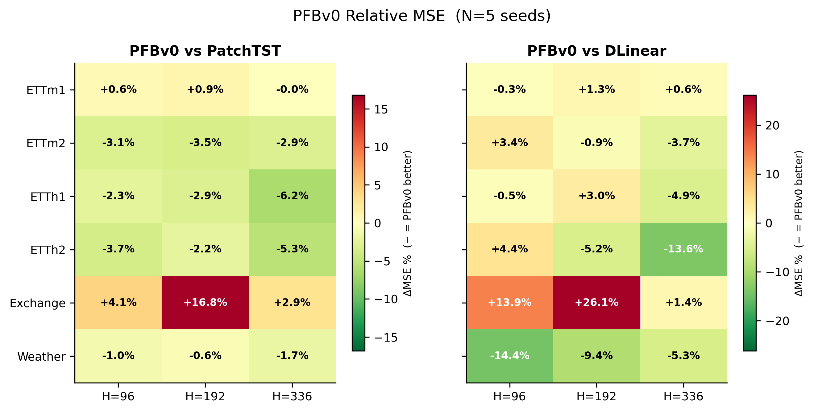

### Fig. 3 — Capacity-Matched Control Results
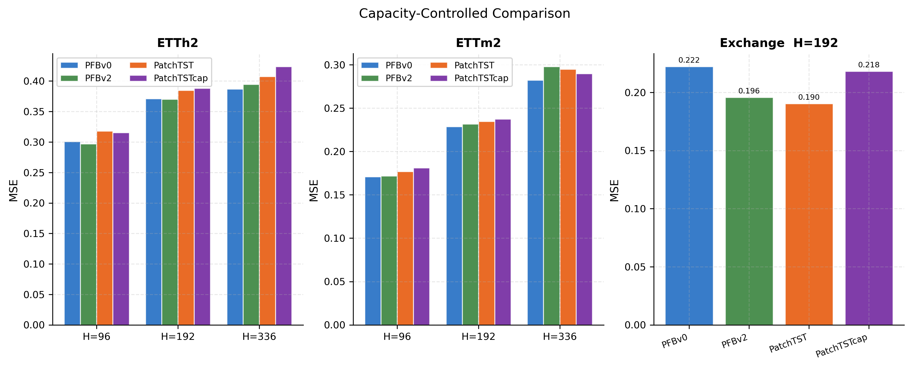

### Fig. 4 — Efficiency Pareto (Accuracy vs. Inference Cost)
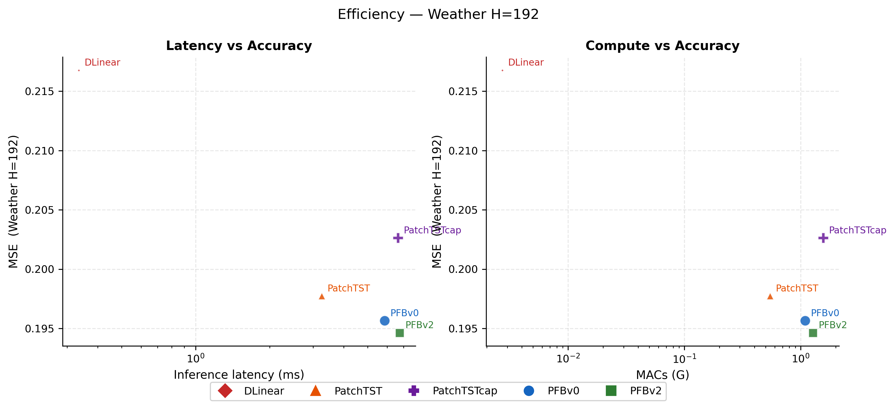

### Fig. 5 — Component Ablation Chain
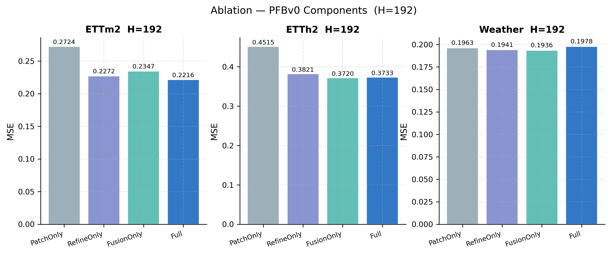

### Fig. 6 — Robustness Under Missing Data
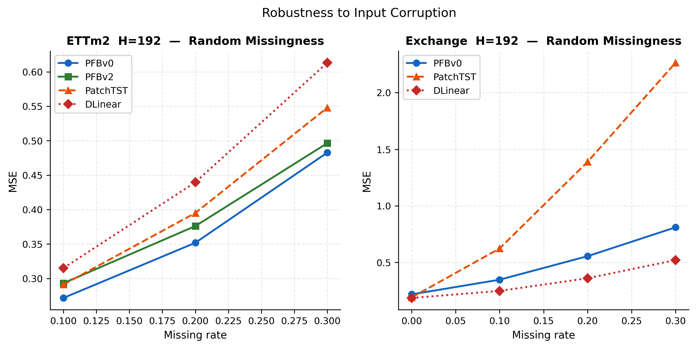

### Fig. 7 — CKA Representation Similarity
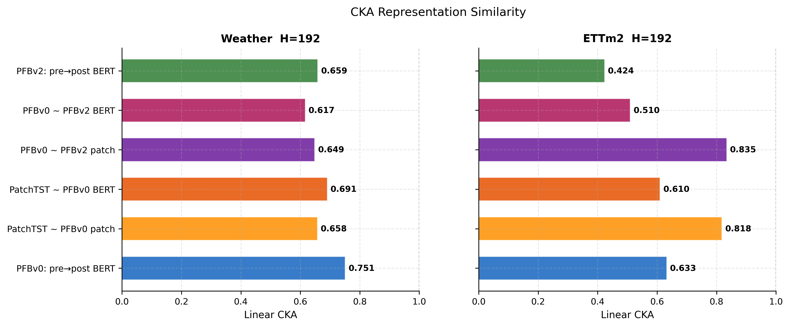

### Appendix Figures (A1–A8)

| | |
|:---:|:---:|
| 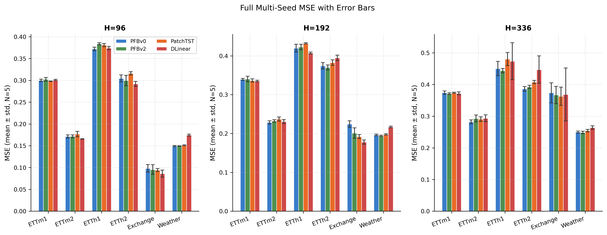<br>**A1** — 5-seed error bars across all horizons | 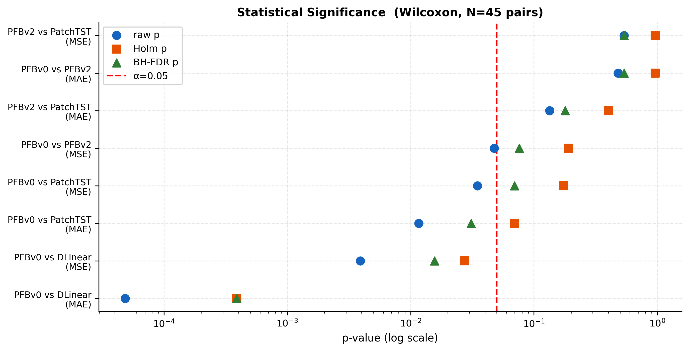<br>**A2** — Wilcoxon significance summary |
| 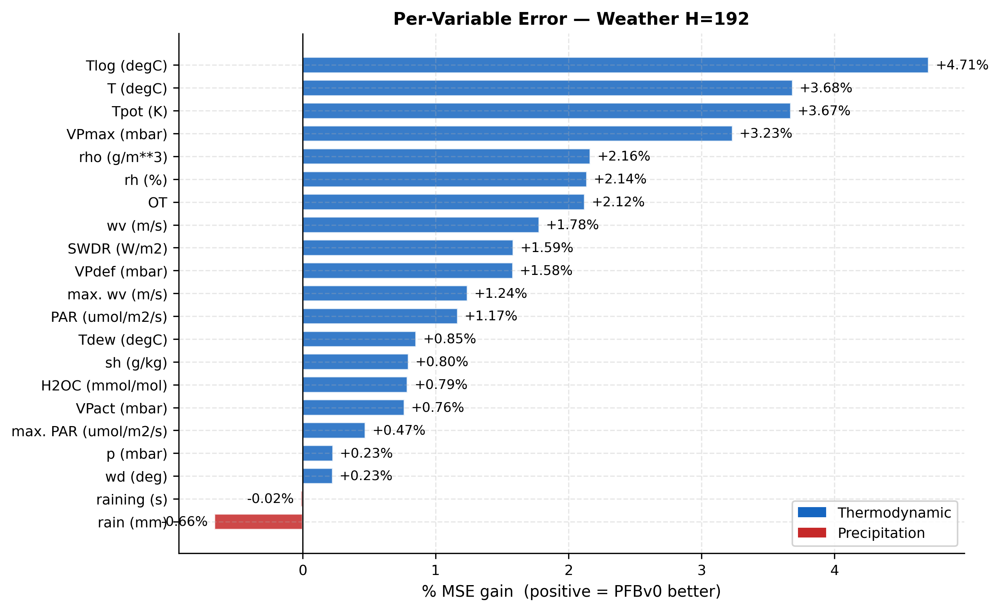<br>**A3** — Per-variable Weather error | 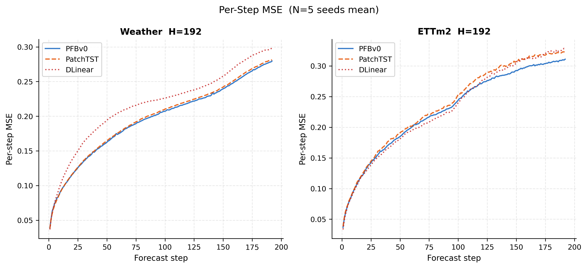<br>**A4** — Error by forecast step |
| 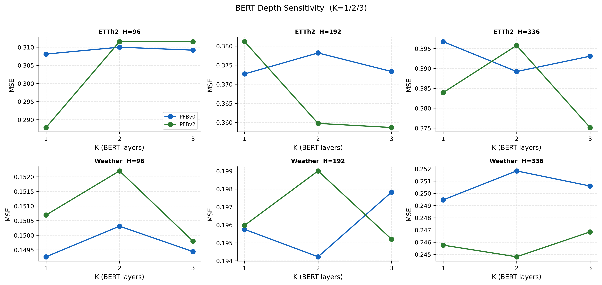<br>**A5** — BERT refinement depth (K) sensitivity | 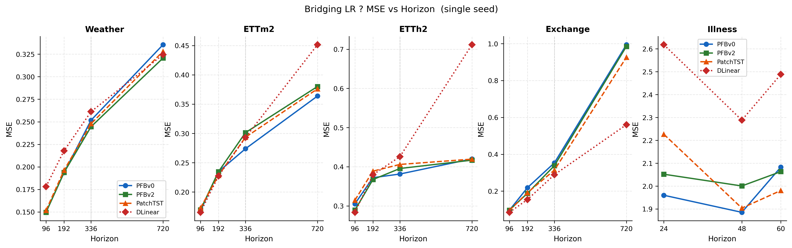<br>**A6** — Bridging LR protocol results |
| 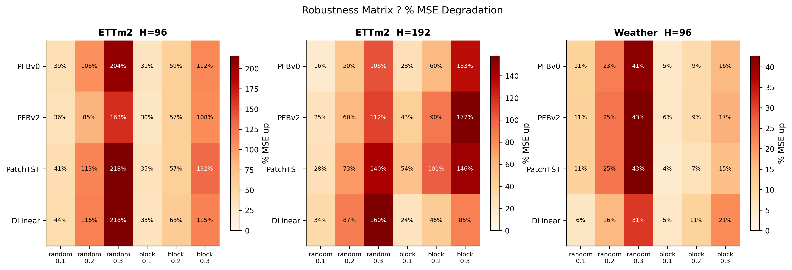<br>**A7** — Robustness matrix | 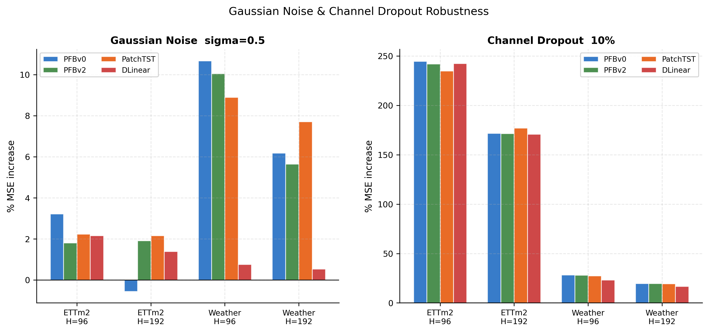<br>**A8** — Gaussian noise & channel dropout |

---

## Citation

If you find this work useful, please cite:

```bibtex
@article{ahmad2026patchfusionbert,
  title   = {PatchFusionBERT: Post-Encoder Fusion for Patch-Based Long-Horizon Time Series Forecasting},
  author  = {Ahmad, Hussein and Mortazavi, Seyyed Kasra and Benarbia, Taha and Al Machot, Fadi and Kyamakya, Kyandoghere},
  journal = {IEEE Access},
  year    = {2026}
}
```

---

## Acknowledgements

This codebase is built on top of [**Time-Series-Library (TSLib)**](https://github.com/thuml/Time-Series-Library) by THUML @ Tsinghua University. We thank the TSLib authors for their open and well-maintained framework.
