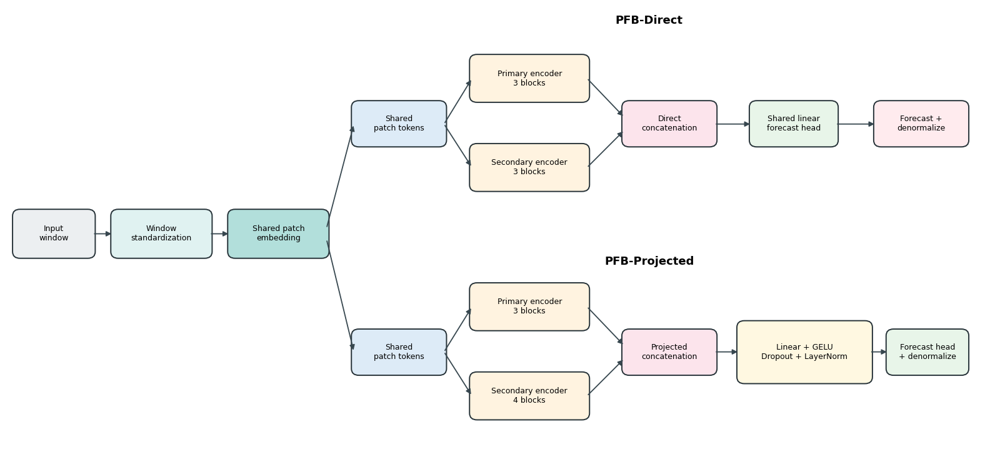

# PFB Forecasting

Parallel patch-encoder fusion for long-horizon time-series forecasting.

[](https://www.python.org/)
[](https://pytorch.org/)
[](https://github.com/thuml/Time-Series-Library)
[](LICENSE)

This repository provides code, model definitions, experiment runners, compact
result summaries, and figure assets for evaluating parallel patch-encoder fusion
within a PatchTST-style forecasting workflow.

The central comparison is controlled and within-family:

- `PatchTST`: single patch-encoder reference model.
- `PFB-Direct`: two parallel patch encoders with direct concatenation.
- `PFB-Projected`: two parallel patch encoders with a projection block after concatenation.

External models such as DLinear, iTransformer, TiDE, TimeXer, and recent
patch/fusion baselines are included as forecasting context.

## Architecture



The design keeps the same patch-token sequence for both encoder streams, applies
independent Transformer encoders, fuses the stream outputs, and maps the fused
representation to the forecasting horizon.

## Repository layout

```text
.
|-- run.py                    # main training and evaluation entry point
|-- models/                   # forecasting models and architectural controls
|-- exp/                      # experiment dispatch
|-- data_provider/            # dataset loaders
|-- layers/                   # shared neural-network layers
|-- utils/                    # metrics and training utilities
|-- experiments/              # date-free experiment runners
|-- analysis/                 # notes for analysis workflow locations
|-- figures/                  # figure assets used by the current study
`-- results_summary/          # compact CSV summaries with run-hardware labels
```

Large generated artifacts are intentionally not tracked in git:

- `data/`
- `results/`
- `checkpoints/`
- `test_results/`

Copy those folders directly when continuing interrupted experiments on another
machine.

## Installation

Use Python 3.10:

```powershell
pip install -r requirements.txt
```

If multiple Python environments are available, pass the intended interpreter to
the experiment runner with `--python`.

## Data

Place benchmark CSV files under:

```text
data/
```

The high-dimensional benchmark extension expects:

```text
data/electricity.csv
data/traffic.csv
```

Candidate benchmark extensions use the same `data/` folder.

## Main experiment runners

High-dimensional core datasets:

```powershell
python .\experiments\core_benchmarks\run_expensive_core_5seed.py --skip-completed
```

Candidate datasets:

```powershell
python .\experiments\core_benchmarks\run_candidate_core_5seed.py --skip-completed
```

Targeted patch/stride/learning-rate sensitivity:

```powershell
python .\experiments\targeted_hpo\run_targeted_hpo.py --stage final --skip-completed
```

Secondary sensitivity around the selected configuration:

```powershell
python .\experiments\secondary_sensitivity\run_secondary_sensitivity.py --stage final --skip-completed
```

Long-horizon and topology-control campaigns:

```powershell
python .\experiments\long_horizon\run_h720_and_topology_campaign.py --campaign h720_external --skip-completed
```

Recent baseline context:

```powershell
python .\experiments\recent_baselines\run_recent_baselines_5seed.py --execute --skip-completed
```

Gateformer and EntroPE adapters expect their official source checkouts under
`experiments/recent_baselines/official_sources/`. That folder is treated as a
local dependency and is not tracked in git.

Cross-variate diagnostic:

```powershell
python .\experiments\cross_variate\run_cross_variate_5seed.py --skip-completed
```

Checkpoint-based diagnostics:

```powershell
python .\experiments\diagnostics\run_branch_corruption.py
python .\experiments\diagnostics\run_representation_diagnostics.py
python .\experiments\diagnostics\run_missingness_mechanisms.py
```

Use `--max-runs N` on runners that support batching.

## Results

Compact summaries are stored in:

```text
results_summary/
```

Hardware label used in the CSV summaries:

```text
experiment_run_on = NVIDIA GeForce RTX 2080 Ti
```

## Citation

If you use this repository, cite it as:

```bibtex
@software{pfb_forecasting_2026,
  title  = {PFB Forecasting: Parallel Patch-Encoder Fusion for Time-Series Forecasting},
  author = {Ahmad, Hussein and Mortazavi, Seyyed Kasra and Benarbia, Taha and Al Machot, Fadi and Kyamakya, Kyandoghere},
  year   = {2026},
  url    = {https://github.com/Hussein-Ahmad-Ahmad/pfb-forecasting}
}
```

Please also cite the associated article and the original
[Time-Series-Library](https://github.com/thuml/Time-Series-Library) project.
