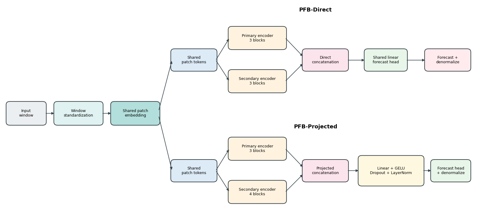

# PFB Forecasting

Parallel patch-encoder fusion for long-horizon time-series forecasting.



PFB is a PatchTST-family architecture that runs the same patch-token
sequence through two parallel Transformer encoder streams before prediction. The
project studies the accuracy and capacity behavior of this design relative to
PatchTST-family controls.

## Models

| Model | Description |
|---|---|
| PatchTST | Single patch-encoder baseline. |
| PFB-Direct | Parallel encoders with direct concatenation. |
| PFB-Projected | Parallel encoders with a projection block after concatenation. |

## Repository areas

- `models/`: model definitions and controls.
- `scripts/paper/`: benchmark runners.
- `docs/`: project context and pipeline notes.
- `paper/figures/`: clean figure assets.

## Quick commands

```powershell
python .\scripts\paper\run_core_dataset_benchmark.py --dataset electricity --skip-completed
python .\scripts\paper\run_core_dataset_benchmark.py --dataset traffic --skip-completed
```

## Citation

```bibtex
@software{pfb_forecasting_2026,
  title  = {PFB Forecasting: Parallel Patch-Encoder Fusion for Time-Series Forecasting},
  author = {Ahmad, Hussein and Mortazavi, Seyyed Kasra and Benarbia, Taha and Al Machot, Fadi and Kyamakya, Kyandoghere},
  year   = {2026},
  url    = {https://github.com/Hussein-Ahmad-Ahmad/pfb-forecasting}
}
```
